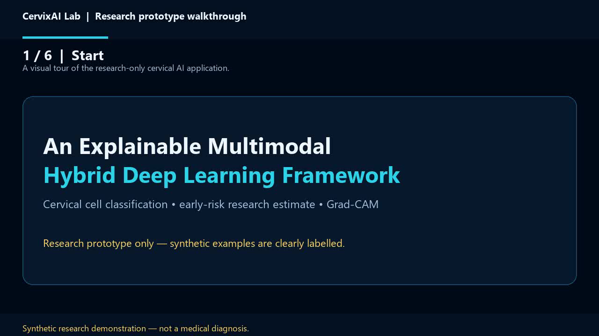

# CervixAI Lab Demo

This folder contains a visual walkthrough of the research prototype. The video is assembled from the application preview screenshots, so it demonstrates the interface flow without claiming a live clinical inference.

## Walkthrough video

[Download or play `cervix_ai_demo_walkthrough.mp4`](cervix_ai_demo_walkthrough.mp4)



## Screenshots

| Step | Preview |
| --- | --- |
| Landing page | [01_landing_page.png](01_landing_page.png) |
| Login and registration | [02_register_login_page.png](02_register_login_page.png) |
| Image classification workspace | [03_dashboard_image_lab.png](03_dashboard_image_lab.png) |
| Clinical risk and synthetic results | [04_demo_results_and_risk.png](04_demo_results_and_risk.png) |
| Mobile PWA layout | [05_mobile_pwa_view.png](05_mobile_pwa_view.png) |

## Run the live application

From the `cervical_cancer_project` directory:

```powershell
Copy-Item .env.example .env
.\.venv\Scripts\python.exe -m uvicorn app:app --host 127.0.0.1 --port 8001
```

Open `http://127.0.0.1:8001/`. The preview dashboard is available at `http://127.0.0.1:8001/preview/dashboard` without authentication. Real registration and login require PostgreSQL configured through `DATABASE_URL`.

All demonstrations are synthetic and for research-interface review only. They are not medical diagnoses.
